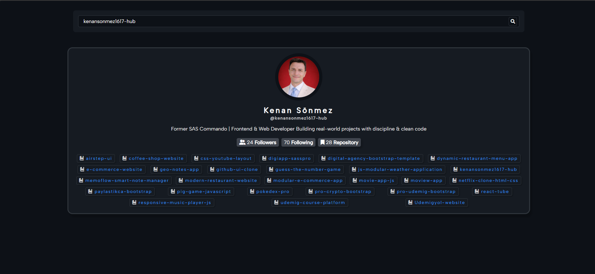
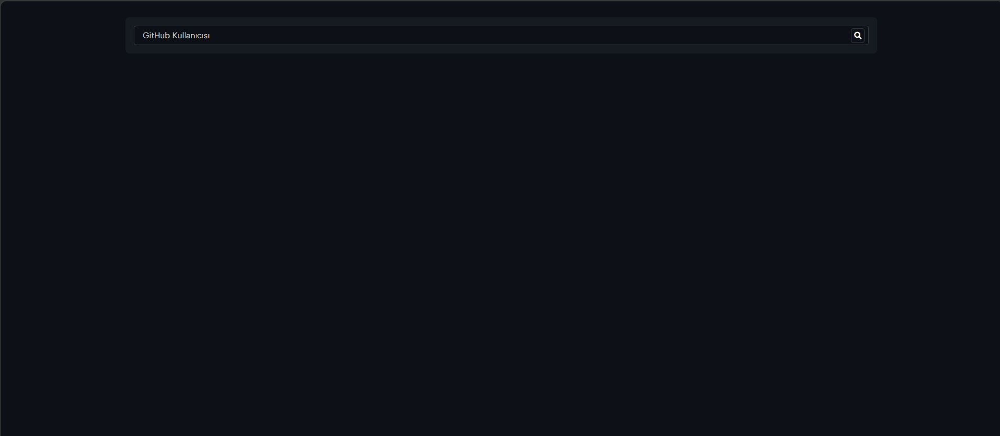

<h1 align="center">🔍 GitHub Profile Explorer</h1>

HTML, CSS ve Vanilla JavaScript kullanılarak geliştirilmiş,
GitHub kullanıcılarını arayıp profil bilgilerini ve tüm repolarını görüntüleyebilen
modern ve responsive bir <strong>GitHub User Explorer Application</strong> çalışmasıdır.

<h2>📌 Proje Amacı</h2>

Bu proje, GitHub API kullanarak kullanıcı verisi çekme, dinamik UI oluşturma
ve asenkron veri yönetimi konularında pratik yapmak amacıyla geliştirilmiştir.
Aynı zamanda API ile çalışma, hata yönetimi ve DOM manipülasyonu üzerine odaklanılmıştır.

<ul>
<li>GitHub kullanıcı arama</li>
<li>Profil bilgilerini dinamik olarak görüntüleme</li>
<li>Kullanıcının tüm repolarını listeleme</li>
<li>API ile veri çekme ve yönetme</li>
<li>Hata yönetimi (404 vs.)</li>
</ul>

<h2>🛠 Kullanılan Teknolojiler</h2>

<ul>
<li>HTML5 (Semantic yapı)</li>
<li>CSS3 (Modern ve responsive tasarım)</li>
<li>Vanilla JavaScript (ES6+)</li>
<li>Axios (API istekleri için)</li>
<li>GitHub REST API</li>
<li>Font Awesome</li>
<li>Google Fonts</li>
</ul>

<h2>✨ Öne Çıkan Özellikler</h2>

<ul>
<li>GitHub kullanıcı arama sistemi</li>
<li>Dinamik kullanıcı kartı oluşturma</li>
<li>Profil bilgileri (followers, following, repo sayısı)</li>
<li>Tüm repository’leri listeleme</li>
<li>Responsive repo grid yapısı</li>
<li>Hata durumlarında kullanıcıya geri bildirim</li>
<li>Modern ve kullanıcı dostu arayüz</li>
<li>Temiz ve okunabilir kod yapısı</li>
</ul>

<h2>🔮 Geliştirilebilir Özellikler</h2>

<ul>
<li>Repo filtreleme (yıldız sayısına göre)</li>
<li>Arama debounce (rate limit azaltma)</li>
<li>Loading skeleton ekranı</li>
<li>Dark/Light mode toggle</li>
</ul>

<h2>📂 Proje Yapısı</h2>

<pre>
github-profile-explorer/
│
├── index.html
├── style.css
├── app.js
├── image.png
└── image.gif
</pre>

<h2>📸 Proje Önizleme</h2>

<h2>🎥 Demo (GIF)</h2>

<h2>🚀 Kurulum</h2>

Projeyi klonlayın:

<pre>
git clone https://github.com/kenansonmez1617-hub/github-profile-explorer.git
</pre>

Ardından <strong>index.html</strong> dosyasını tarayıcıda açmanız yeterlidir.

<h2>👨‍💻 Geliştirici</h2>

<strong>Kenan Sönmez</strong> 
Frontend Developer

GitHub: 
<a href="https://github.com/kenansonmez1617-hub" target="_blank">
https://github.com/kenansonmez1617-hub
</a>

LinkedIn: 
<a href="https://www.linkedin.com/in/kenan-sonmez" target="_blank">
https://www.linkedin.com/in/kenan-sonmez
</a>

<h2>📄 Lisans</h2>

Bu proje eğitim ve portfolyo amaçlı geliştirilmiştir.
İncelenebilir ve geliştirilebilir.

⭐ Projeyi beğendiyseniz GitHub üzerinden yıldız bırakabilirsiniz.

